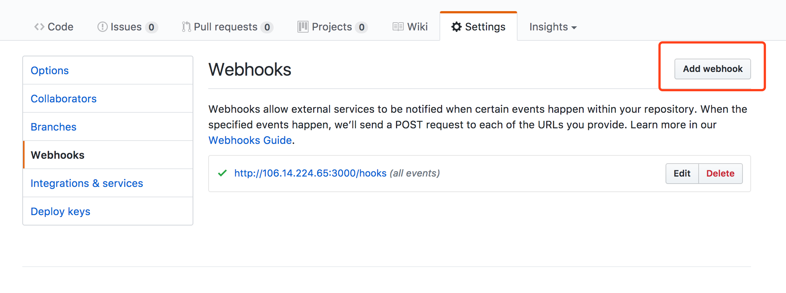
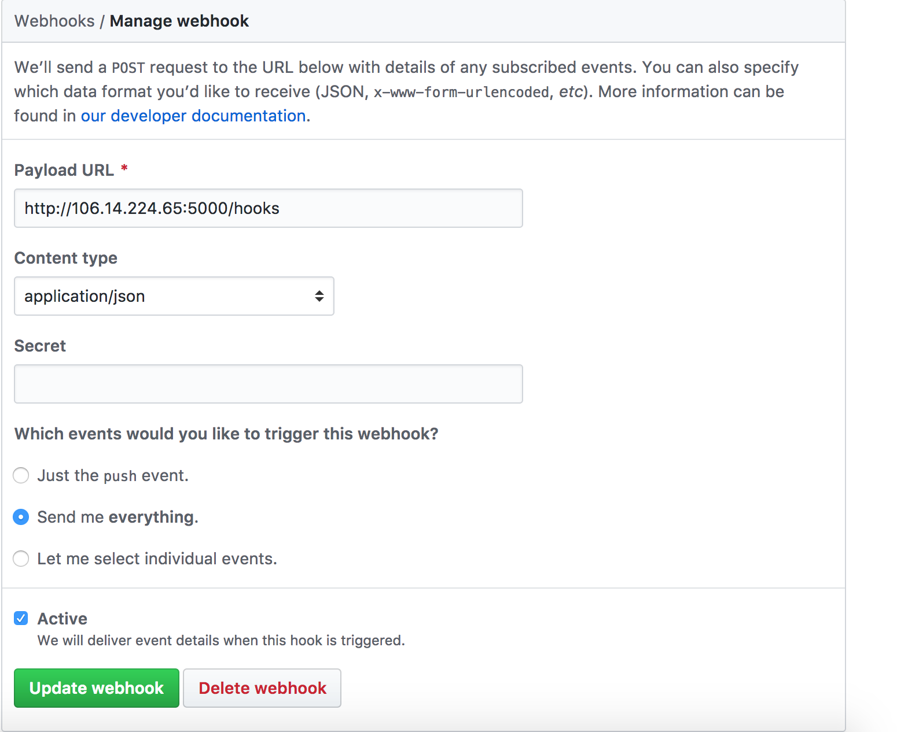

> 转发 github pr/review 等信息到微信的一个小工具🔧

### 接入 webhook
1. 进入项目的 Setting -> Webhooks 中点击 Add webhook

2. 填入如下内容  
url: http://106.14.224.65:5000/hooks  
content-type 选 application/json  
触发事件选择 Send me everything  
最后点 Add webhook

### 添加机械人好友
在微信上搜索 bot-wx，添加好友时附带 github 的用户名，机械人会根据这个备注进行消息转发

### 参与开发
fork 本仓库  
  
安装依赖 npm i  

进行开发 npm run dev （建议再申请一个微信号做调试）

### 一点说明
本地开发的时候，会与我的服务器进行一个 socket 长连接，进而能转发 webhook 的请求到本地服务器，本地收到的请求内容就是 webhook 发送给服务端的内容，具体细节可参考 src/proxy.js 文件