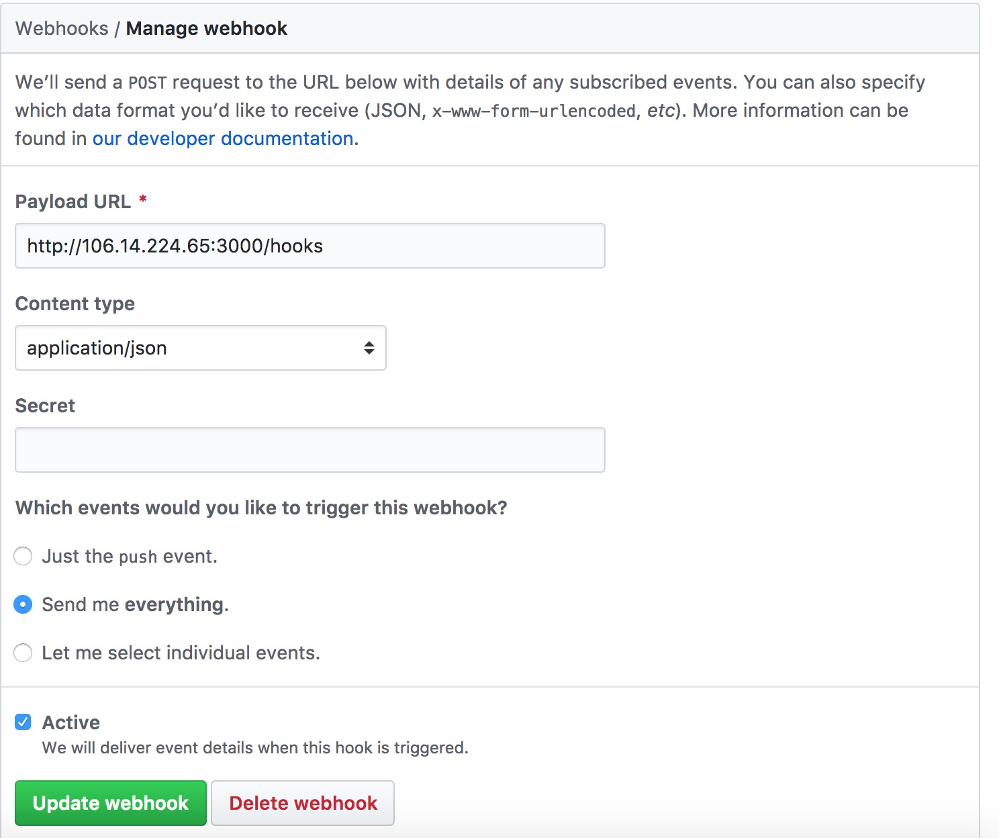

> 转发 github pr/review 等信息到微信的一个小工具🔧

### 接入 webhook
1. 进入项目的 Setting -> Webhooks 中点击 Add webhook

2. 填入如下内容  
url: http://106.14.224.65:3000/hooks  
content-type 选 application/json  
触发事件选择 Send me everything  
最后点 Add webhook

### 添加机械人好友
在微信上搜索 bot-wx，添加好友时附带 github 的用户名，机械人会根据这个备注进行消息转发